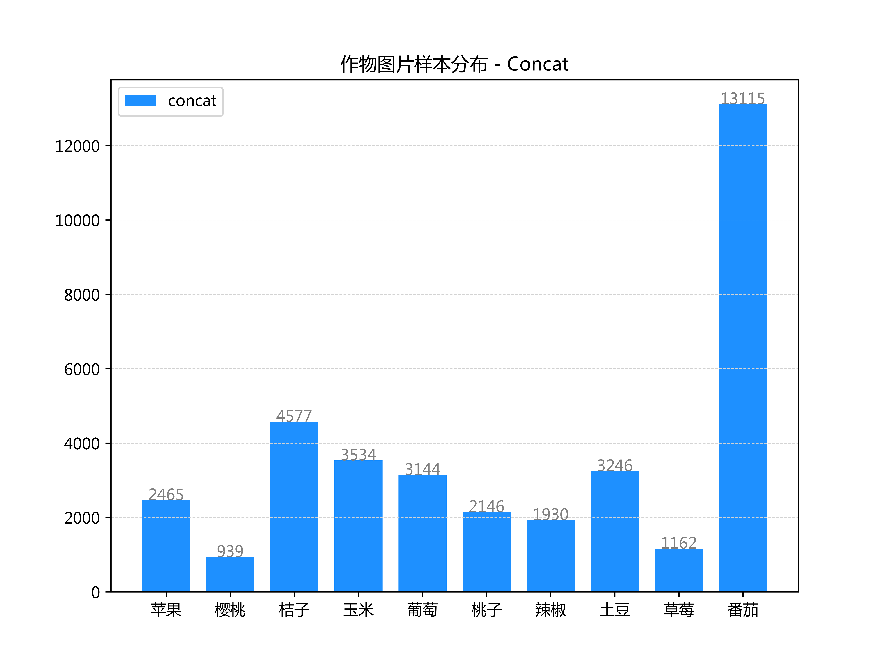
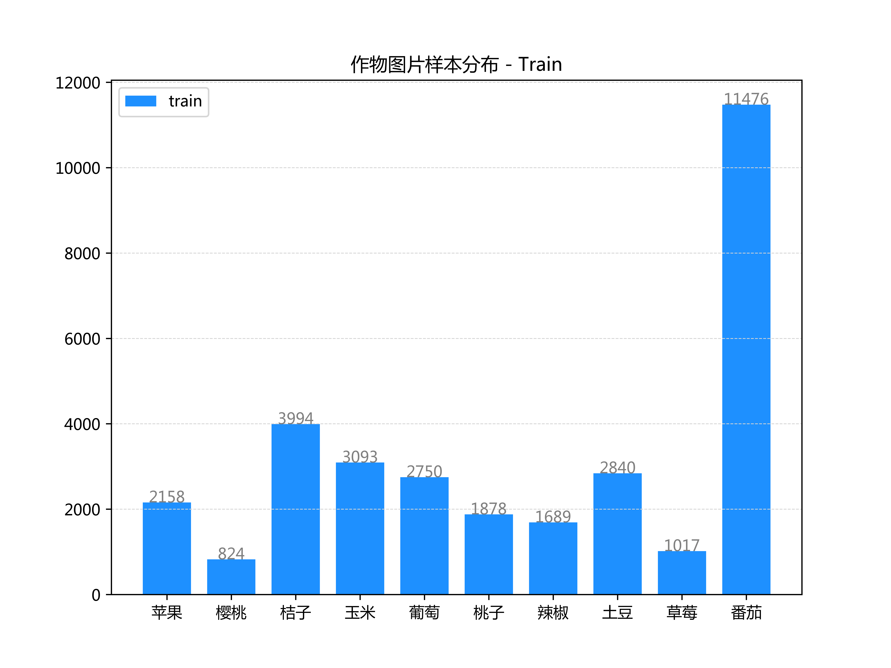

# 【开发文档】作物（叶片图片）分类器模块
*（2019/03/08)*

> **说明：** 该模块的目的是在作物病虫害识别之前，先通过该模块的判定，帮助用户确认将要进行病虫害识别的**作物类别**。该模块的输入为用户采集的图像，输出为预测的**作物**类别。
> 
> - 如果该模块输出的类别与用户选择的拟识别作物种类一致，那么调用该作物品种所对应的病虫害识别分类器模块；
> - 如果该模块输出的类别与用户选择的拟识别作物种类不一致，则反馈用户，提示其需要确认所选作物种类与输入的图像一致。
> 
> **模块路径：**
> `kefeng@aizhong-ubuntu-server:~/2019-PlantDiseaseRecognition-v2/02-category-classifier-module`
> 

## 0. 开发流程概述
1. 数据整理——将原始数据集（按照原始类别号分别存储于"0"~"60"共61个文件夹中的图像数据）重新整理为以作物名称为文件夹名的结构（如"apple","corn")。存为副本数据集。训练集、验证集划分。
2. 数据分析——数据均衡、数据增强。
3. 选择已有模型，进行迁移学习。
4. 模型性能分析。

## 1. 数据整理
### 1.1. 数据集
原始数据集存储路径：
```
kefeng@aizhong-ubuntu-server:
~/data_pool/plant_disease_dataset
├── 299_dataset_for_keras
├── dataset
└── dataset_for_keras
```
- `299_dataset_for_keras` 为尺寸统一为299x299的按61类整理的数据；
- `dataset`为原始数据；
- `dataset_for_keras`为原始尺寸的按61类整理的数据。

这些数据是2018年11月初参与竞赛时所整理。当前项目的数据整理，则使用`dataset_for_keras`的数据作为初始数据。

### 1.2. 将数据按照作物类别整理成为新的副本
**目标：**
- 将原始数据集（按照原始类别号分别存储于"0"~"60"共61个文件夹中的图像数据）重新整理为以作物名称为文件夹名的结构（如"apple","corn")。存为副本数据集。

**程序脚本：**
- `01-rearrange-dataset.py` 主脚本
- `kfutils.py` 功能函数

处理完成后的数据文件夹结构：
```
~/data_pool/plant_disease_dataset/dataset_plant_categorial                                                   
├── concat
│   ├── apple
│   ├── cherry
│   ├── citrus
│   ├── corn
│   ├── grape
│   ├── peach
│   ├── pepper
│   ├── potato
│   ├── strawberry
│   └── tomato
├── train
│   ├── apple
│   ├── cherry
│   ├── citrus
│   ├── corn
│   ├── grape
│   ├── peach
│   ├── pepper
│   ├── potato
│   ├── strawberry
│   └── tomato
└── val
    ├── apple
    ├── cherry
    ├── citrus
    ├── corn
    ├── grape
    ├── peach
    ├── pepper
    ├── potato
    ├── strawberry
    └── tomato
```

***【完成 2019/03/08】***

### 1.3. 训练集、验证集划分
本部分已经在`01-rearrange-dataset.py`中同时完成。
数据概览：
- 总图片数：36258
- 训练集图片数：31718
- 验证集图片数：4540

## 2. 数据分析
### 2.1. 按类别的数据分布（共10类）
脚本：`02-data-distribution.py`





### 2.2. 数据增强（Data Augmentation）
考虑效率问题，目前直接使用Keras的实时图像增强。

## 3. 模型、训练